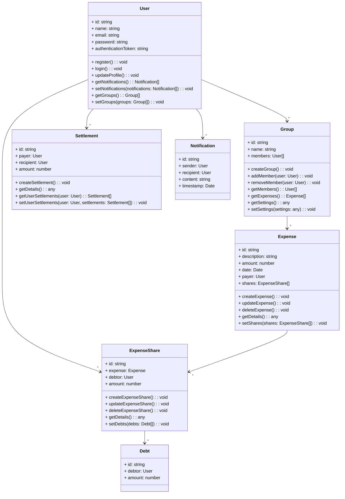

```mermaid
classDiagram
    class User {
        + id: string
        + name: string
        + email: string
        + password: string
        + authenticationToken: string

        + register(): void
        + login(): void
        + updateProfile(): void
        + getNotifications(): Notification[]
        + setNotifications(notifications: Notification[]): void
        + getGroups(): Group[]
        + setGroups(groups: Group[]): void
    }

    class Group {
        + id: string
        + name: string
        + members: User[]

        + createGroup(): void
        + addMember(user: User): void
        + removeMember(user: User): void
        + getMembers(): User[]
        + getExpenses(): Expense[]
        + getSettings(): any
        + setSettings(settings: any): void
    }

    class Expense {
        + id: string
        + description: string
        + amount: number
        + date: Date
        + payer: User
        + shares: ExpenseShare[]

        + createExpense(): void
        + updateExpense(): void
        + deleteExpense(): void
        + getDetails(): any
        + setShares(shares: ExpenseShare[]): void
    }

    class Settlement {
        + id: string
        + payer: User
        + recipient: User
        + amount: number

        + createSettlement(): void
        + getDetails(): any
        + getUserSettlements(user: User): Settlement[]
        + setUserSettlements(user: User, settlements: Settlement[]): void
    }

    class ExpenseShare {
        + id: string
        + expense: Expense
        + debtor: User
        + amount: number

        + createExpenseShare(): void
        + updateExpenseShare(): void
        + deleteExpenseShare(): void
        + getDetails(): any
        + setDebts(debts: Debt[]): void
    }

    class Notification {
        + id: string
        + sender: User
        + recipient: User
        + content: string
        + timestamp: Date
    }

    class Debt {
        + id: string
        + debtor: User
        + amount: number
    }

    User --> "*" Group
    User --> "*" Notification
    User --> "*" Settlement
    User --> "*" ExpenseShare
    Group --> "*" Expense
    Expense --> "*" ExpenseShare
    ExpenseShare --> "*" Debt
```