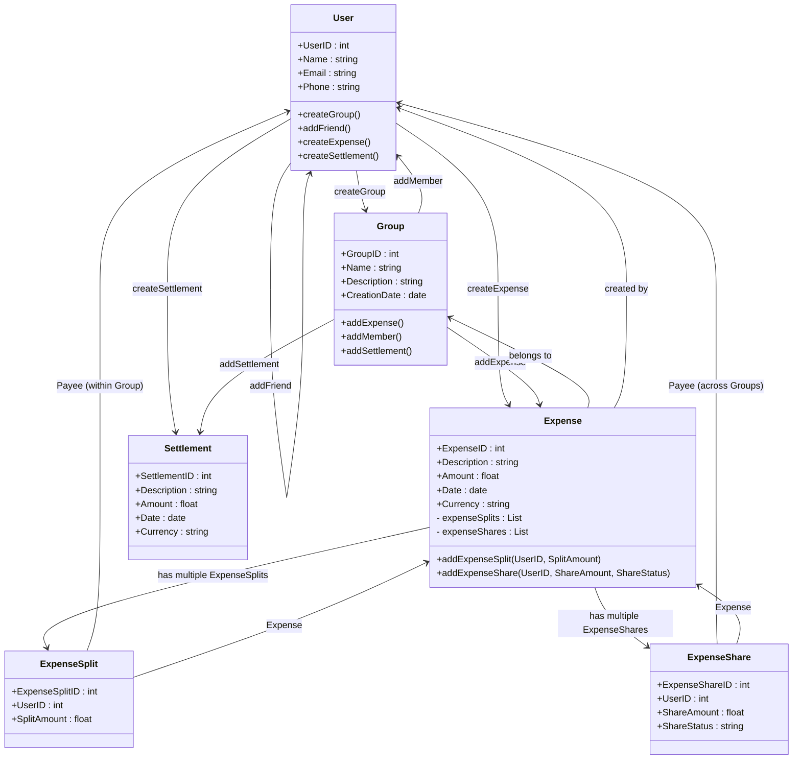

```mermaid
classDiagram
    class User {
        +UserID : int
        +Name : string
        +Email : string
        +Phone : string
        +createGroup()
        +addFriend()
        +createExpense()
        +createSettlement()
    }
    class Group {
        +GroupID : int
        +Name : string
        +Description : string
        +CreationDate : date
        +addExpense()
        +addMember()
        +addSettlement()
    }
    
    class Expense {
        +ExpenseID : int
        +Description : string
        +Amount : float
        +Date : date
        +Currency : string
        - expenseSplits : List<ExpenseSplit>
        - expenseShares : List<ExpenseShare>
        +addExpenseSplit(UserID, SplitAmount)
        +addExpenseShare(UserID, ShareAmount, ShareStatus)
    }
    class ExpenseSplit {
        +ExpenseSplitID : int
        +UserID : int
        +SplitAmount : float
    }
    class ExpenseShare {
        +ExpenseShareID : int
        +UserID : int
        +ShareAmount : float
        +ShareStatus : string
    }
    class Settlement {
        +SettlementID : int
        +Description : string
        +Amount : float
        +Date : date
        +Currency : string
    }

    User --> Group : createGroup
    User --> User : addFriend
    User --> Expense : createExpense
    User --> Settlement : createSettlement

    Group --> Expense : addExpense
    Group --> User : addMember
    Group --> Settlement : addSettlement

    Expense --> Group : belongs to
    Expense --> User : created by

    Expense --> ExpenseSplit : has multiple ExpenseSplits
    Expense --> ExpenseShare : has multiple ExpenseShares

    ExpenseSplit --> User : Payee (within Group)
    ExpenseSplit --> Expense : Expense

    ExpenseShare --> User : Payee (across Groups)
    ExpenseShare --> Expense : Expense

```